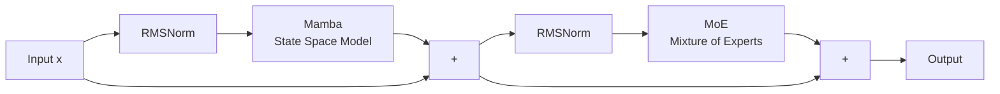

# MambaDecoderBlock: A State Space Model-Based Decoder Architecture

MambaDecoderBlock is a novel decoder architecture that replaces traditional self-attention mechanisms with Mamba state space models, augmented by Mixture of Experts (MoE) layers. This implementation provides an efficient alternative to Transformer-based decoders, offering linear complexity in sequence length while maintaining competitive performance through the integration of state space models and expert routing mechanisms.

## Architecture Overview

The MambaDecoder architecture consists of several key components arranged in a hierarchical structure:

1. **Token Embedding Layer**: Maps discrete tokens to continuous vector representations
2. **Post-Embedding Normalization** (optional): Applies RMSNorm to stabilize training
3. **Mamba Decoder Blocks**: Stacked layers combining Mamba state space models with MoE
4. **Post-Mamba MLA Block** (optional): Multi-Head Latent Attention layer for enhanced context modeling
5. **Output Head**: Final projection to vocabulary space

### Architecture Diagram

```mermaid
graph TB
    Input[Token IDs<br/>Shape: batch × seq_len] --> Embed[Embedding Layer<br/>vocab_size → dim]
    Embed --> PostNorm{Post Embed<br/>Norm?}
    PostNorm -->|Yes| Norm1[RMSNorm]
    PostNorm -->|No| Layers
    Norm1 --> Layers
    
    subgraph Layers[Mamba Decoder Blocks × depth]
        direction TB
        Layers --> Block1[MambaDecoderBlock 1]
        Block1 --> Block2[MambaDecoderBlock 2]
        Block2 --> BlockN[...]
        BlockN --> BlockLast[MambaDecoderBlock N]
    end
    
    BlockLast --> PostMLA{Post Mamba<br/>MLA Block?}
    PostMLA -->|Yes| MLABlock[MLABlock]
    PostMLA -->|No| OutputHead
    MLABlock --> OutputHead
    
    subgraph OutputHead[Output Head]
        direction TB
        OutputHead --> Norm2[RMSNorm]
        Norm2 --> Linear[Linear Projection<br/>dim → vocab_size]
    end
    
    Linear --> Output[Logits<br/>Shape: batch × seq_len × vocab_size]
    
```

### MambaDecoderBlock Internal Structure



## Key Components

### 1. Mamba State Space Model

The Mamba component leverages state space models (SSMs) to achieve linear complexity in sequence length. Unlike attention mechanisms that require quadratic computation, Mamba processes sequences efficiently through selective state space modeling, enabling effective long-range dependency modeling.

**Key Features:**

- Linear time complexity: O(n) vs O(n²) for attention
- Selective state space modeling for adaptive sequence processing
- Configurable depth through `n_layers` parameter

### 2. Mixture of Experts (MoE)

The MoE layer implements a sparse expert routing mechanism, where only a subset of experts are activated for each input token. This design enables scaling model capacity without proportional increases in computational cost.

**Configuration Parameters:**

- `n_experts`: Total number of expert networks
- `n_activated`: Number of experts activated per token
- `expert_inter_dim`: Intermediate dimension for expert networks (optional)
- `shared_expert_inter_dim`: Dimension for shared expert (optional)
- `use_adaptive_bias`: Enable adaptive bias updates
- `bias_update_rate`: Learning rate for bias adaptation

### 3. Multi-Head Latent Attention (MLA)

The optional MLA block provides an efficient attention mechanism that combines:

- **LoRA-based Projections**: Low-rank adaptations for query and key-value projections
- **Rotary Positional Embeddings (RoPE)**: Position-aware attention computation
- **KV Caching**: Efficient incremental decoding support
- **Latent Attention**: "Absorb" mode for reduced memory footprint

**Attention Modes:**

- `naive`: Standard attention with full KV cache
- `absorb`: Latent attention with compressed KV representations

### 4. Normalization

The architecture employs RMSNorm (Root Mean Square Normalization) throughout, providing:

- Improved training stability
- Reduced computational overhead compared to LayerNorm
- Better performance on various tasks

## Installation

```bash
pip install -r requirements.txt
```

**Dependencies:**

- `torch`: PyTorch deep learning framework
- `mambapy`: Mamba state space model implementation
- `open_kimi`: MoE implementation

## Usage

### Basic MambaDecoder

```python
import torch
from mamba_decoder.mamba_block import MambaDecoder, MambaConfig, MoEConfig

# Initialize model
model = MambaDecoder(
    vocab_size=32000,
    max_seq_len=128,
    depth=6,
    dim=512,
    post_embed_norm=True,
    mamba_config=MambaConfig(
        d_model=512,
        n_layers=1,
    ),
    moe_config=MoEConfig(
        dim=512,
        n_experts=6,
        n_activated=2,
        expert_inter_dim=None,
        shared_expert_inter_dim=None,
        use_adaptive_bias=True,
        bias_update_rate=0.01,
    ),
)

# Forward pass
x = torch.randint(0, 32000, (2, 128))
out = model(x)
print(out.shape)  # (2, 128, 32000)
```

### MambaDecoder with Post-Mamba MLA Block

```python
model = MambaDecoder(
    vocab_size=32000,
    max_seq_len=128,
    depth=6,
    dim=512,
    heads=64,
    post_embed_norm=True,
    mamba_config=MambaConfig(
        d_model=512,
        n_layers=1,
    ),
    moe_config=MoEConfig(
        dim=512,
        n_experts=6,
        n_activated=2,
        expert_inter_dim=None,
        shared_expert_inter_dim=None,
        use_adaptive_bias=True,
        bias_update_rate=0.01,
    ),
    post_mamba_mla_block=True,  # Enable MLA block
)

# Forward pass with caching support
out = model(x, start_pos=0, mask=None)
```

## Architecture Details

### MambaDecoder Parameters

| Parameter | Type | Description |
|-----------|------|-------------|
| `vocab_size` | int | Size of the vocabulary |
| `max_seq_len` | int | Maximum sequence length |
| `depth` | int | Number of MambaDecoderBlock layers |
| `dim` | int | Model dimension (hidden size) |
| `heads` | int | Number of attention heads (for MLA block) |
| `post_embed_norm` | bool | Apply RMSNorm after embedding |
| `mamba_config` | MambaConfig | Configuration for Mamba SSM |
| `moe_config` | MoEConfig | Configuration for MoE layer |
| `post_mamba_mla_block` | bool | Add MLA block after Mamba blocks |

### MambaConfig Parameters

| Parameter | Type | Description |
|-----------|------|-------------|
| `d_model` | int | Model dimension for Mamba |
| `n_layers` | int | Number of Mamba layers per block |

### MoEConfig Parameters

| Parameter | Type | Description |
|-----------|------|-------------|
| `dim` | int | Input/output dimension |
| `n_experts` | int | Total number of expert networks |
| `n_activated` | int | Number of experts activated per token |
| `expert_inter_dim` | int \| None | Intermediate dimension for experts |
| `shared_expert_inter_dim` | int \| None | Dimension for shared expert |
| `use_adaptive_bias` | bool | Enable adaptive bias updates |
| `bias_update_rate` | float | Learning rate for bias adaptation |

## Computational Complexity

The MambaDecoder architecture offers significant computational advantages:

- **Mamba Blocks**: O(n) complexity per block, where n is sequence length
- **MoE Layers**: O(n × k) complexity, where k is the number of activated experts
- **MLA Block** (if enabled): O(n²) complexity, but with reduced memory footprint through latent attention
- **Overall**: Linear scaling with sequence length when MLA is disabled

## Design Rationale

### Why Mamba Instead of Attention?

1. **Scalability**: Linear complexity enables processing longer sequences efficiently
2. **Selectivity**: State space models can selectively process relevant information
3. **Memory Efficiency**: Reduced memory requirements for long sequences

### Why MoE?

1. **Capacity Scaling**: Increase model capacity without proportional compute increase
2. **Specialization**: Different experts can specialize in different aspects of the data
3. **Efficiency**: Only activate necessary experts for each token

### Why Optional MLA Block?

1. **Hybrid Approach**: Combines benefits of both state space models and attention
2. **Flexibility**: Can be enabled for tasks requiring explicit attention mechanisms
3. **Efficiency**: Latent attention mode reduces memory overhead

## Citation

If you use this implementation in your research, please cite:

```bibtex
@software{mambadecoderblock,
  title={MambaDecoderBlock: A State Space Model-Based Decoder Architecture},
  author={Kye Gomez},
  year={2024},
  url={https://github.com/kyegomez/MambaDecoderBlock}
}
```

## License

See LICENSE file for details.

## Acknowledgments

This implementation builds upon:

- Mamba state space models
- Mixture of Experts architectures
- Multi-Head Latent Attention mechanisms
